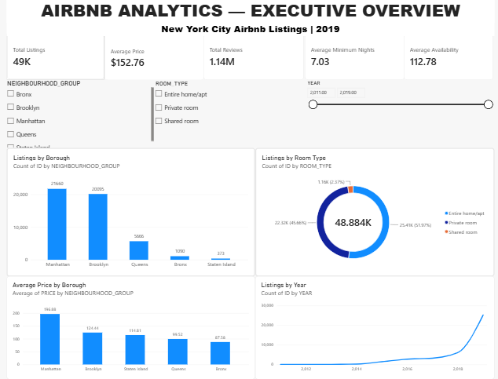
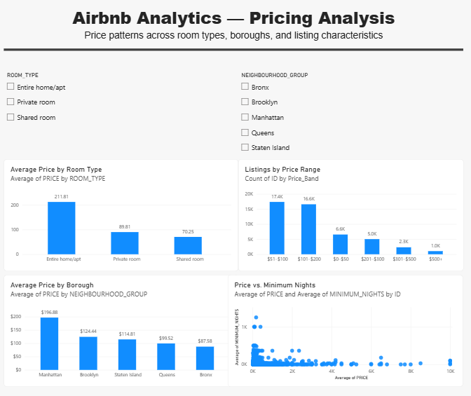
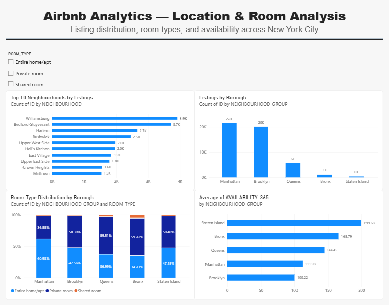
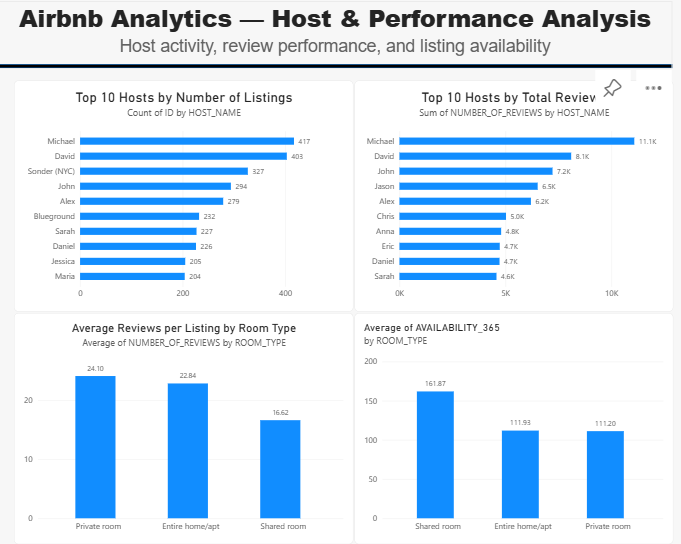

# Airbnb Analytics & Business Intelligence Project

An end-to-end data analytics and Business Intelligence project using the Airbnb NYC 2019 dataset. The project demonstrates how raw data can be transformed into a structured analytical data warehouse and interactive BI dashboard using Python, Snowflake, SQL, and Power BI.

##
## 📌 Project Overview

The goal of this project was to build a complete analytics solution that transforms raw Airbnb listing data into meaningful business insights.

The project covers:

Raw Data → Data Cleaning → Star Schema → Snowflake → SQL Analysis → Power BI Dashboard

The solution focuses on understanding Airbnb listings across different locations, room types, pricing, hosts, reviews, and availability.

##
## 🎯 Business Problem & Goals

Airbnb listing data contains useful information about pricing, locations, accommodation types, hosts, and availability. However, the raw dataset requires cleaning, structuring, and analysis before it can be used effectively for business reporting.

###
### Goals

◽ Analyze Airbnb listings across NYC boroughs and neighbourhoods

◽ Understand pricing patterns across locations and room types

◽ Analyze room type distribution and listing availability

◽ Explore host activity and review performance

◽ Build a structured data warehouse for analytical reporting

◽ Develop an interactive BI dashboard for business users


##
## 🗃️ Data Source

Dataset: Airbnb NYC 2019

Source: Kaggle

Original size: 48,895 rows × 16 columns


After data cleaning, 48,884 valid listings were used for analysis.


The dataset includes information such as:


◽Listing and host identifiers

◽Neighbourhood and borough

◽Room type

◽Price

◽Minimum nights

◽Number of reviews

◽Availability

◽Last review date

##
## 🛠 Technologies & Tools 

| Category               |  Technologies    |
| --------------------   |  ------------    | 
| Programming            |  Python          | 
| Data Manipulation      |  Pandas          |
| Data Warehouse         |  Snowflake       | 
| Query Language         |  SQL             |
| Business Intelligence  |  Power BI Online | 
| Version Control        |  Git & GitHub    |


##
## 🏗️ Data Architecture

A Star Schema was designed to structure the Airbnb data for analytical reporting.

Fact Table

◽Fact_Listings

Dimension Tables

◽Dim_Host

◽Dim_Location

◽Dim_Room_Type

◽Dim_Date

The fact table stores listing-level measures, while the dimension tables provide descriptive information for analysis.

##
## 🏢 Project Workflow

1.Data Profiling & Cleaning

  Python and Pandas were used to inspect data types, missing values, duplicate records, invalid values, and potential outliers.

2.Data Modelling

  The cleaned data was transformed into a Star Schema with fact and dimension tables.

3.Snowflake Data Warehouse

  The dimensional model was implemented in Snowflake and the processed datasets were loaded into the warehouse.

4.SQL Analysis

  SQL was used to validate the data and answer business questions related to pricing, location, room types, hosts, availability, and trends.

5.Power BI Dashboard

  The Snowflake data warehouse was connected to Power BI Online to create an interactive semantic model and a four-page BI report.

##
## 🔑 Key Findings

Some of the key results from the analysis include:

### Metric	Result

|                           |              |
| --------------------      |  ------------| 
| Total Listings            |  48,884      | 
| Average Price             |  $152.76     |
| Total Reviews             | 1,137,628    | 
| Average Minimum Nights    |  7.03        |
| Average Availability      |  112.78 days | 


### Selected Insights

◽Manhattan had the highest number of listings, followed by Brooklyn.

◽Entire home/apt was the most common room type.

◽Airbnb prices varied considerably across boroughs and room types.

◽A small number of hosts accounted for a large number of listings.

◽Listing availability and review activity varied across accommodation types and locations.

##
## 📈 Power BI Dashboard

The final Power BI report contains four analytical pages:

### Dashboard Preview

#### Executive Overview – Overall marketplace KPIs and listing distribution



#### Pricing Analysis – Pricing patterns by location and room type



#### Location & Room Analysis – Neighbourhood, borough, and room type analysis



#### Host & Performance Analysis – Host activity, reviews, and availability



##
## Project Resources

◽Detailed Project Walkthrough:<a href="https://medium.com/@jayawansa123s/building-an-end-to-end-airbnb-analytics-solution-with-python-snowflake-sql-and-power-bi-f2ad4544a234
">Visit My Blogs</a>

◽Power BI Report: <a href="powerbi/Power_bi_Report.md"> </a>

##
## Repository Structure

```text
Airbnb-Analytics-Project/
│
├── data/                 # Raw and processed datasets
├── docs/                 # Project documentation
├── diagrams/             # Data model diagrams
├── sql/                  # SQL scripts and analysis
├── powerbi/              # Power BI files and resources
├── screenshots/          # Dashboard screenshots
└── README.md             # Project overview
```
##
##  Conclusion
 
 This project demonstrates an end-to-end data analytics and Business Intelligence workflow, from raw dataset profiling and cleaning to dimensional modelling, cloud data warehousing, SQL analysis, and interactive dashboard development.

It combines technical data skills with business-focused analysis to turn raw Airbnb listing data into a structured and accessible reporting solution.

##
👨‍💻 A self-directed project built to strengthen Snowflake, SQL, data modelling, and BI skills  through an end-to-end analytics workflow.


